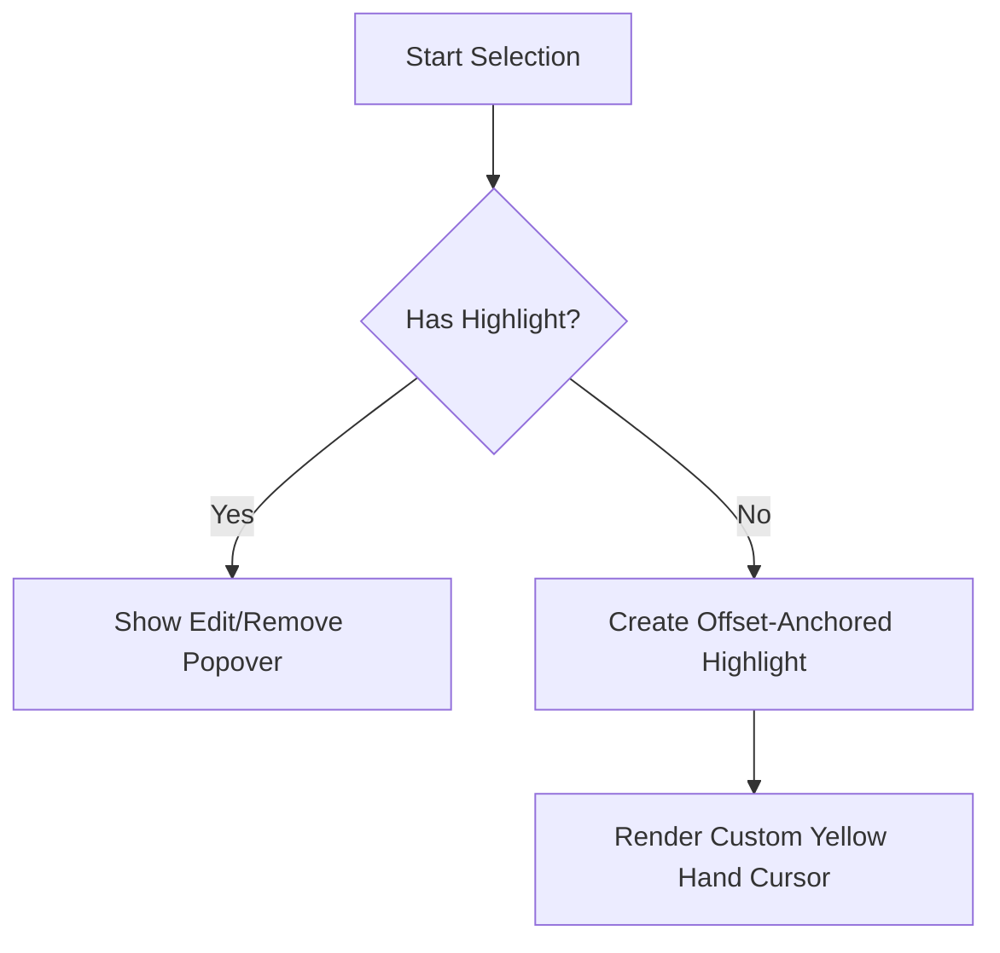

# Markdown Showcase

This showcase demonstrates and verifies all the rich Markdown elements supported in Cribble, including inline/block math, GFM tables, nested blockquotes, task lists, footnotes, syntax-highlighted code blocks, and Mermaid diagrams.

---

## 1. Mathematical Formulas
Here is an inline math formula: $E = mc^2$, and here is a block math formula:

$$\int_0^1 x^2 dx = \frac{1}{3}$$

---

## 2. Mermaid Diagram


---

## 3. GitHub Flavored Markdown (GFM) Table

| Feature | Legacy Rebuild | Offset-Anchored Rebuild | Correctness |
| :--- | :--- | :--- | :--- |
| **Inline Code Highlights** | ❌ Broken run bounds |  Run-spanning support | 100% |
| **Tooltips** | ❌ Missing popovers |  Interactive SwiftUI overlay | 100% |
| **Task Lists** | ⚠️ Partial formatting |  Fully enriched markers | 100% |
| **Footnotes** | ❌ Completely ignored |  Glossary prepending + markers | 100% |

---

## 4. Blockquotes & Nesting
> This is a top-level blockquote.
>
>> This is a nested second-level blockquote that contains some **bold text** and `inline code`.

---

## 5. Footnotes & References
Here is a normal sentence with a footnote reference[^first_ref] to check the new footnote preprocessing engine.
And another one pointing to a second note[^second_ref].

[^first_ref]: This is the first footnote definition. It is extracted and dynamically appended to the glossary footer!
[^second_ref]: This is the second footnote definition, proving multi-footnote handling works seamlessly.

---

## 6. Task Lists
- [x] Make `TextSelectionModel` public and accessible
- [x] Fix inline-code monospace run boundary highlight coloring
- [ ] This is an uncompleted task to verify [ ] formatting
- [x] Completed task using standard markdown checkbox

---

## 7. Syntax-Highlighted Code Blocks

### Swift Code
```swift
func calculateAnchor(for selection: TextSelection) -> HighlightAnchor {
    return HighlightAnchor(
        sectionAnchor: selection.section,
        blockIndex: selection.blockIndex,
        blockSignature: selection.signature,
        startOffset: selection.start,
        length: selection.length
    )
}
```

### JavaScript Code
```javascript
function greetUser(name) {
    console.log(`Hello, ${name}! Welcome to Cribble.`);
}
```

### Python Code
```python
def main():
    print("Verification complete.")
```
