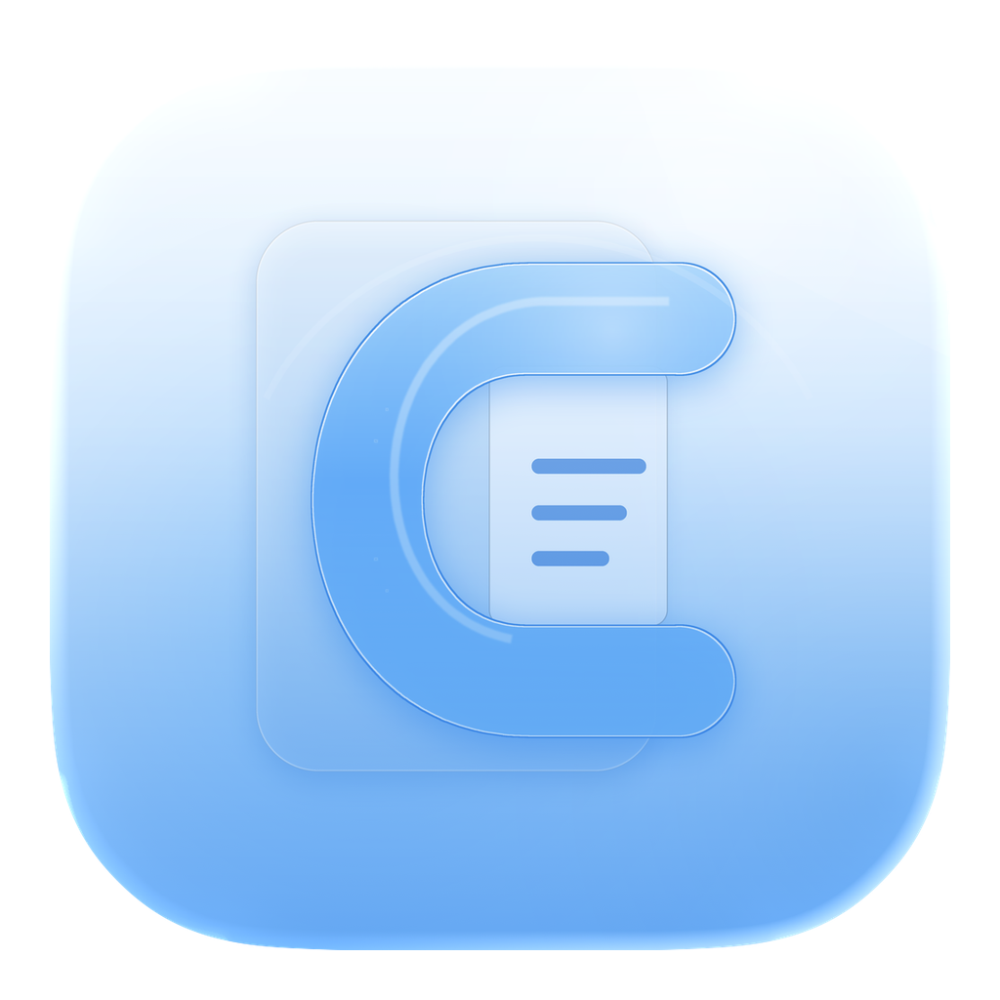

<p align="center">
  
</p>

<h1 align="center">Cribble</h1>

<p align="center">
  A native macOS Markdown reader for local folders, rich reading, and safe AI-assisted note linking.
</p>

Cribble is a native macOS 15+ Markdown reader for folder-based note libraries.
It is built for people who already write in plain `.md` files, but want a
calmer, richer, more connected place to read them than Finder, a code editor, or
a full writing app.

The product idea is simple: keep editing outside Cribble, and make Cribble the
best Mac-native surface for reading, browsing, connecting, and understanding a
local folder of notes.

## Product Vision

Cribble treats every folder as a small knowledge space. Folders become shelves,
`README.md` files become folder landing pages, and Markdown files become
beautiful reading documents with native navigation.

The app is intentionally read-only. Your source files stay ordinary Markdown on
disk. When you want to edit, Cribble sends the current file to the app you
choose, such as VS Code, Xcode, Obsidian, TextEdit, Terminal, or the system
default app.

Cribble should feel like a Mac library: quiet, legible, fast, local, and deeply
respectful of the user's files.

## Core Ideas

- **Read beautifully:** render Markdown with strong typography, tables, task
  states, code blocks, Mermaid diagrams, chart/graph fences, images, links, and
  math without adding an editor surface.
- **Navigate locally:** preserve the folder tree, open folder `README.md` files,
  resolve wiki links, and make cross-file reading feel natural.
- **Connect notes safely:** use local Codex or Claude CLIs to suggest links, then
  show a native patch preview before any file is changed.
- **Stay native:** use macOS sidebars, toolbars, menus, Settings, system theme,
  and Liquid Glass-era materials instead of custom heavy chrome.

## Current Features

- Opens local folders in place and shows only folders plus `.md` files.
- Keeps multiple opened folders in a persistent sidebar library.
- Creates a `README.md` for every imported folder that does not already have one.
- Opens a folder's `README.md` automatically when the folder is selected.
- Sorts files inside folders by name, creation date, or last updated date.
- Auto-reloads Markdown files when they change on disk.
- Renders rich Markdown with Textual and native rich-block previews, including
  task markers, ordered task lists, code blocks, Mermaid diagrams, chart/graph
  fences, tables, relative images, links, and LaTeX math.
- Uses Roobert for reading typography and Monaco for monospaced text.
- Provides XXS-to-XXL reader text sizing.
- Supports wiki links such as `[[Home]]`, `[[Note#Heading]]`, and
  `[[Note|Label]]`.
- Shows linked files inline in the document and as a collapsible linked-files
  panel.
- Drops one reading bookmark per page at the current reading section with `B`
  or `D`, then resumes through the bookmark strip.
- Highlights selected passages with `H`, or enters a continuous highlight mode
  for quick mark-as-you-read workflows.
- Uses a tall highlight-mode cursor so it is clear when drag-to-highlight is
  active.
- Opens the current file with a toolbar `Open in` menu, including detected
  eligible apps, the default app, and Finder reveal.
- Offers preview-first AI linking with local Codex or Claude, using the lowest
  configured model for each provider.
- Provides a Diagnostic Report sheet with copy, GitHub issue, and GitHub pull
  request actions for quick user reports.
- Ships as a signed, notarized macOS DMG with a drag-to-install Finder layout.

## Latest Release: 1.0.4

Cribble 1.0.4 focuses on reading flow polish and stability:

- Added per-document reading bookmarks for the exact section where you stopped
  reading.
- Added Mac-preview-style text highlighting with a quick `H` shortcut and a
  continuous highlight mode.
- Added right-click note editing for highlighted text; notes are stored with
  the highlight and attached to that highlighted range for hover.
- Fixed a pasteboard restore crash that could happen after highlighting.
- Fixed a Textual selection-layout spin that could hang the app after copying,
  highlighting, or editing a highlight note.
- Restored the compact macOS toolbar button treatment.
- Updated the reader cursor in highlight mode to a longer straight line.
- Upgraded Markdown reading so ordered checkboxes, Mermaid fences, graph/chart
  fences, and code blocks render as first-class reading blocks.
- Preserved existing bookmark/highlight storage in
  `~/Library/Application Support/Cribble/ReadingAnnotations.json`.

## Reading Workflow

1. Open one or more folders from the sidebar.
2. Browse folders and Markdown files in the native tree.
3. Click a folder to read its `README.md` landing page.
4. Click a note to read rendered Markdown.
5. Follow wiki links or relative `.md` links inside the reader.
6. Use `Open in` when you want to edit the file elsewhere.

Cribble never adds an in-app Markdown editor. That boundary is deliberate: the
app is a reader and connector, not a writing surface.

## Link Workflow

Cribble resolves explicit wiki links by filename, title, H1, aliases, keywords,
tags, and relative paths where possible. Resolved links navigate inside the app.
Web links open externally.

Linked notes appear in two places:

- **Inline:** a compact `Linked files:` line appears in the document flow.
- **Panel:** a collapsible card grid can be expanded when you want a more visual
  overview of connected notes.

## AI Link Notes

Cribble can ask a locally installed AI tool to suggest sparse, high-confidence
wiki links between existing files.

Supported providers:

- Codex CLI
- Claude CLI

The AI command runs in planning/read-only mode and is asked to return unified
diff output only. Cribble parses that diff into a native preview sheet. Applying
the patch verifies source lines before writing; canceling writes nothing.

No AI command is allowed to directly mutate files in v1.

## Design Direction

Cribble aims for a quiet, native macOS reading experience:

- sidebar-first library navigation
- compact toolbar actions
- system theme awareness
- Liquid Glass materials on macOS 26+, with native material fallbacks on older systems
- restrained card use
- readable line lengths on wide screens
- polished behavior across small, medium, and large windows

## Run Locally

```sh
./script/build_and_run.sh
```

You can also open `Cribble.xcworkspace` in Xcode. The workspace contains the
Swift package.

## Test

```sh
swift test
```

## Validate A Release

After packaging and notarization, run:

```sh
./script/validate_release.sh 1.0.4
```

The script checks the Apple Silicon binary, minimum macOS version, code signing,
Gatekeeper acceptance, notarization tickets, and DMG contents.

The tests cover folder scanning, sort behavior, wiki-link parsing, link-index
resolution, Markdown display preparation, rich fenced-block splitting, and
unified-diff parsing/apply logic.

## Release

Current version: `1.0.4`

```sh
./script/package_release.sh 1.0.4
```

The release script:

- builds the Swift package in release mode for every arch in `ARCHS`
  (default `arm64 x86_64`, so the shipped binary is universal)
- `lipo`s the slices together and prints the resulting architectures and
  `LC_BUILD_VERSION` so you can verify the binary's minimum macOS is what
  you expect (`15.0`, not `26.0`)
- creates `Cribble.app`
- copies the SPM resource bundle (`Bundle.module`) and fails loudly if it
  is missing, so the bundled app icon can't silently disappear
- signs with Developer ID
- creates `releases/Cribble-1.0.4.dmg`
- if `NOTARY_PROFILE=<keychain-profile>` is set, submits the DMG to
  Apple's notary service and staples the ticket
- writes a SHA-256 checksum

```sh
# Apple Silicon + Intel, signed only (Gatekeeper will block on other Macs):
./script/package_release.sh 1.0.4

# Apple Silicon + Intel, signed + notarized + stapled (recommended for
# public sharing):
NOTARY_PROFILE=cribble-notary ./script/package_release.sh 1.0.4

# Apple Silicon only:
ARCHS=arm64 ./script/package_release.sh 1.0.4
```

If you'd rather notarize by hand:

```sh
xcrun notarytool submit releases/Cribble-1.0.4.dmg --keychain-profile cribble-notary --wait
xcrun stapler staple releases/Cribble-1.0.4.dmg
```

Stable release:

https://github.com/adidshaft/cribble/releases/tag/stable

## Product Roadmap

- Back and forward navigation history for reading paths.
- In-document search and heading outline navigation.
- Better unresolved-link views with suggested targets.
- Optional graph view for local file relationships.
- Per-folder reading preferences.
- Quick Look extension for Markdown previews.
- Exportable connected reading bundles.
- URL-scheme or AppleScript hooks for opening notes from other tools.

## Principles

- **Local first:** Cribble reads folders in place and does not upload or sync
  documents by itself.
- **Reader only:** editing belongs in the user's chosen editor.
- **Plain files stay plain:** generated structure should remain ordinary
  Markdown.
- **Preview before mutation:** AI suggestions are patches the user reviews.
- **System native:** the app should feel like it belongs on macOS.
