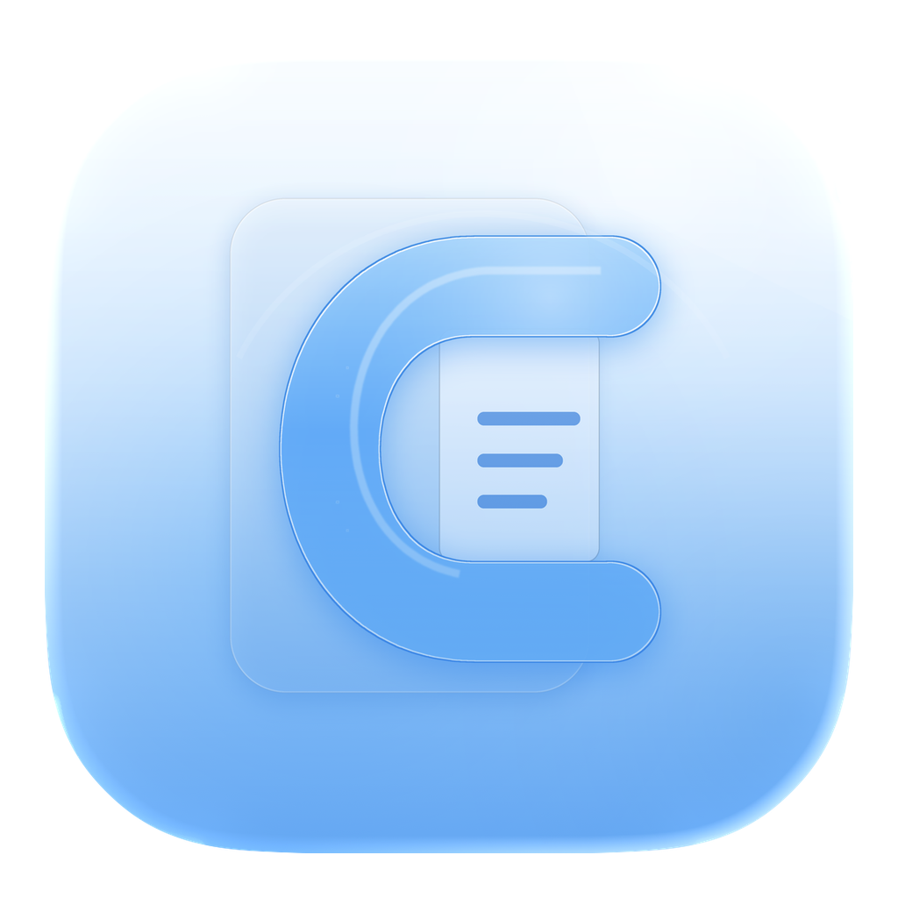

<p align="center">
  
</p>

<h1 align="center">Cribble</h1>

<p align="center">
  A calm, local-first macOS Markdown reader for rich reading, connected notes, and private AI-assisted workflows.
</p>

<p align="center">
  <a href="https://github.com/adidshaft/cribble/actions/workflows/ci.yml"></a>
  <a href="https://cribble.kyokasuigetsu.xyz"></a>
  <a href="LICENSE"></a>
  
  <a href="https://github.com/adidshaft/cribble/releases/tag/stable"></a>
</p>

<p align="center">
  <a href="https://cribble.kyokasuigetsu.xyz">Website</a>
  ·
  <a href="https://github.com/adidshaft/cribble/releases/tag/stable">Download</a>
  ·
  <a href="CONTRIBUTING.md">Contributing</a>
  ·
  <a href="ROADMAP.md">Roadmap</a>
  ·
  <a href="MAINTAINER_HANDBOOK.md">Maintainer Handbook</a>
</p>

Cribble is a native macOS 15+ Markdown reader for folder-based note libraries.
It is built for people who already write in plain `.md` files, but want a
calmer, richer, more connected place to read them than Finder, a code editor, or
a full writing app.

The product idea is simple: keep editing outside Cribble, and make Cribble the
best Mac-native surface for reading, browsing, connecting, and understanding a
local folder of notes.

**Website:** [cribble.kyokasuigetsu.xyz](https://cribble.kyokasuigetsu.xyz) is
the public home for downloads, privacy/support copy, and release links.

## Open Source and Direction

Cribble's source code is available under the Apache License 2.0. The project is
open to outside contributions, especially focused bug fixes, docs, tests,
accessibility improvements, Markdown rendering fixes, diagnostics, and
agreed-upon provider or integration work.

Product direction is owner-led. New features, major UX changes, AI behavior,
storage/write policy, monetization, distribution, and roadmap changes should
start in GitHub Discussions or an issue before implementation. Official
releases, App Store and DMG distribution, paid features, and Cribble branding
remain maintainer-controlled.

Useful project docs:

- `CONTRIBUTING.md` for build, test, pull request, and DCO signoff guidance.
- `GOVERNANCE.md` for the owner-led decision model.
- `ROADMAP.md` for current contribution lanes and future directions.
- `docs/extensions.md` for Cribble's declarative extension manifest API.
- `SECURITY.md` for private vulnerability reporting.
- `TRADEMARK.md` for Cribble name and logo usage.
- `MAINTAINER_HANDBOOK.md` for release, website, and project-management habits.

## Product Vision

Cribble treats every folder as a small knowledge space. Folders become shelves,
`README.md` files become folder landing pages, and Markdown files become
beautiful reading documents with native navigation.

The app is intentionally read-only. Your source files stay ordinary Markdown on
disk. When you want to edit, Cribble sends the current file to the app you
choose, such as VS Code, Xcode, Obsidian, TextEdit, Terminal, or the system
default app.

Cribble should feel like a Mac library: quiet, legible, fast, local, and deeply
respectful of the user's files.

## Core Ideas

- **Read beautifully:** render Markdown with strong typography, tables, task
  states, code blocks, Mermaid diagrams, chart/graph fences, images, links, and
  math without adding an editor surface.
- **Navigate locally:** preserve the folder tree, open folder `README.md` files,
  resolve wiki links, and make cross-file reading feel natural.
- **Connect notes safely:** use local Codex or Claude CLIs to suggest links, then
  show a native patch preview before any file is changed.
- **Use AI from native menus:** summarize, explain, find related notes, create
  an index, draft today, extract tasks, and run Project Intelligence without
  memorizing prompts.
- **Extend safely:** start from declarative extension manifests, project-local
  examples, read-only-first contribution guides, and trusted remote runner
  profiles before executable plugins exist.
- **Stay native:** use macOS sidebars, toolbars, menus, Settings, system theme,
  and Liquid Glass-era materials instead of custom heavy chrome.

## Current Features

- Opens local folders in place and shows only folders plus `.md` files.
- Keeps multiple opened folders in a persistent sidebar library.
- Creates a `README.md` for every imported folder that does not already have one.
- Opens a folder's `README.md` automatically when the folder is selected.
- Sorts files inside folders by name, creation date, or last updated date.
- Auto-reloads Markdown files when they change on disk.
- Renders rich Markdown with Textual and native rich-block previews, including
  task markers, ordered task lists, syntax-highlighted code blocks, real
  Mermaid diagrams, chart/graph fences, tables, relative images, links, and
  LaTeX math.
- Bundles a removable DemoNotes sample library on fresh installs so new users
  can immediately inspect rich Markdown, wiki links, task lists, code, math,
  and Mermaid rendering.
- Uses Roobert for reading typography and Monaco for monospaced text.
- Provides XXS-to-XXL reader text sizing.
- Supports wiki links such as `[[Home]]`, `[[Note#Heading]]`, and
  `[[Note|Label]]`.
- Turns missing wiki links into review-first new-note proposals, so users can
  link before writing without silent file creation.
- Shows linked files inline in the document and as a collapsible linked-files
  panel.
- Drops one reading bookmark per page at the current reading section with `B`
  or `D`, then resumes through the bookmark strip.
- Highlights selected passages with `H`, or enters a continuous highlight mode
  for quick mark-as-you-read workflows.
- Uses a tall highlight-mode cursor so it is clear when drag-to-highlight is
  active.
- Opens the current file with a toolbar `Open in` menu, including detected
  eligible apps, the default app, and Finder reveal.
- Offers preview-first AI linking with local Codex or Claude, using the lowest
  configured model for each provider.
- Adds native AI menu commands for summaries, plain-language explanations,
  related-note discovery, reviewed `index.md` proposals, daily notes, and task
  extraction.
- Provides a safe extension foundation with validated `cribble-extension.json`
  manifests, Settings visibility, project-local examples, renderer aliases,
  import lanes, quick actions, remote runner profiles, and copyable proposal /
  review summaries.
- Supports trusted local, VPS, or team OpenAI-compatible intelligence runners
  with visible data-boundary copy, Keychain-backed secrets, consent, and
  revocation paths.
- Provides a Diagnostic Report sheet with copy, GitHub issue, and GitHub pull
  request actions for quick user reports.
- Ships as a signed, notarized macOS DMG with a drag-to-install Finder layout.

## Latest Release: 1.2.1

Cribble 1.2.1 is the stable Cribble AI release:

- Added a private Cribble AI chat HUD with on-device MLX models plus Claude/Codex CLI support.
- Added vault-aware answers, quick actions, slash commands, message actions, file attachments, and folder-aware `@` search.
- Fixed CLI streaming reliability, UTF-8 chunk-boundary decoding, block Markdown rendering in chat answers, and download progress reporting.
- Tightened Local AI download labels so on-device model sizes and live progress are clearer.
- Direct DMG downloads include Local AI unlocked; the Mac App Store build uses a one-time Local AI unlock.


## Reading Workflow

1. Open one or more folders from the sidebar.
2. Browse folders and Markdown files in the native tree.
3. Click a folder to read its `README.md` landing page.
4. Click a note to read rendered Markdown.
5. Follow wiki links or relative `.md` links inside the reader.
6. Use `Open in` when you want to edit the file elsewhere.

Cribble never adds an in-app Markdown editor. That boundary is deliberate: the
app is a reader and connector, not a writing surface.

## Link Workflow

Cribble resolves explicit wiki links by filename, title, H1, aliases, keywords,
tags, and relative paths where possible. Resolved links navigate inside the app.
Web links open externally.

Linked notes appear in two places:

- **Inline:** a compact `Linked files:` line appears in the document flow.
- **Panel:** a collapsible card grid can be expanded when you want a more visual
  overview of connected notes.

## AI Link Notes

Cribble can ask a locally installed AI tool to suggest sparse, high-confidence
wiki links between existing files.

Supported providers:

- Codex CLI
- Claude CLI

The AI command runs in planning/read-only mode and is asked to return unified
diff output only. Cribble parses that diff into a native preview sheet. Applying
the patch verifies source lines before writing; canceling writes nothing.

No AI command is allowed to directly mutate files in v1.

## Native AI Menu

The AI menu exposes common workflows without prompt memorization:

- **Summarize Current Note**
- **Explain Current Note Simply**
- **Find Related Notes**
- **Create Index Note**
- **Draft Today with AI**
- **Extract Tasks from Current Note**
- **Project Intelligence**

Generated notes and task/index proposals still use the same review-first
preview flow before writing. Project Intelligence artifacts can be copied as
Markdown with type/path/save metadata, and Ask answers can be copied with the
original question attached for issues, PRs, notes, or team review.

## Design Direction

Cribble aims for a quiet, native macOS reading experience:

- sidebar-first library navigation
- compact toolbar actions
- system theme awareness
- Liquid Glass materials on macOS 26+, with native material fallbacks on older systems
- restrained card use
- readable line lengths on wide screens
- polished behavior across small, medium, and large windows

## Run Locally

```sh
./script/build_and_run.sh
```

You can also open `Cribble.xcworkspace` in Xcode. The workspace contains the
Swift package.

## Test

```sh
swift test
```

## Validate A Release

After packaging and notarization, run:

```sh
./script/validate_release.sh 1.2.1
```

The script checks the Apple Silicon binary, minimum macOS version, code signing,
Gatekeeper acceptance, notarization tickets, and DMG contents.

The tests cover folder scanning, sort behavior, wiki-link parsing, link-index
resolution, Markdown display preparation, rich fenced-block splitting, and
unified-diff parsing/apply logic.

## Release

Current version: `1.2.1`

```sh
./script/package_release.sh 1.2.1
```

The release script:

- builds the Swift package in release mode for every arch in `ARCHS`
  (default `arm64 x86_64`, so the shipped binary is universal)
- `lipo`s the slices together and prints the resulting architectures and
  `LC_BUILD_VERSION` so you can verify the binary's minimum macOS is what
  you expect (`15.0`, not `26.0`)
- creates `Cribble.app`
- copies the SPM resource bundle (`Bundle.module`) and fails loudly if it
  is missing, so the bundled app icon can't silently disappear
- signs with Developer ID
- creates `releases/Cribble-1.2.1.dmg`
- if `NOTARY_PROFILE=<keychain-profile>` is set, submits the DMG to
  Apple's notary service and staples the ticket
- writes a SHA-256 checksum

```sh
# Apple Silicon + Intel, signed only (Gatekeeper will block on other Macs):
./script/package_release.sh 1.2.1

# Apple Silicon + Intel, signed + notarized + stapled (recommended for
# public sharing):
NOTARY_PROFILE=cribble-notary ./script/package_release.sh 1.2.1

# Apple Silicon only:
ARCHS=arm64 ./script/package_release.sh 1.2.1
```

If you'd rather notarize by hand:

```sh
xcrun notarytool submit releases/Cribble-1.2.1.dmg --keychain-profile cribble-notary --wait
xcrun stapler staple releases/Cribble-1.2.1.dmg
```

Stable release:

https://github.com/adidshaft/cribble/releases/tag/stable

## Contributing

Please read `CONTRIBUTING.md` before opening a pull request. Cribble uses DCO
signoff (`git commit -s`) and asks contributors to discuss feature or product
direction work before coding. Bug reports, docs fixes, tests, accessibility
improvements, rendering fixes, and reproducible diagnostics are the best first
contribution lanes. New extension ideas should start with
`docs/extension-contributions.md`: ideas can be ambitious, while first PRs stay
declarative, read-only, least-access, least-writing, and native SwiftUI.
Inside the app, use **Settings > Extensions > Contribution Guide** or
**Settings > Extensions > Copy Proposal** for the first handoff; the Help menu
keeps **Help > Copy Extension Proposal** available too. Importer ideas should
use **Settings > Extensions > Import lanes > Copy Review** after a lane appears,
or **Help > Copy Import Lane Setup Review** before adding one. Remote runner
ideas should use **Settings > Project Intelligence > Copy Review** or
**Help > Copy Remote Runner Setup Review**.

## Product Roadmap

Cribble's roadmap is maintainer-led. See `ROADMAP.md` for current contribution
areas and `docs/cribble-open-source-plan.md` for the longer open-source
preparation runbook.

## Principles

- **Local first:** Cribble reads folders in place and does not upload or sync
  documents by itself.
- **Reader only:** editing belongs in the user's chosen editor.
- **Plain files stay plain:** generated structure should remain ordinary
  Markdown.
- **Preview before mutation:** AI suggestions are patches the user reviews.
- **System native:** the app should feel like it belongs on macOS.

## License

Cribble source code is licensed under the Apache License 2.0. See `LICENSE`.

The Cribble name, app icon, logo, screenshots, release artwork, and other brand
assets are not granted by the source license. See `TRADEMARK.md` for brand-use
guidelines.
