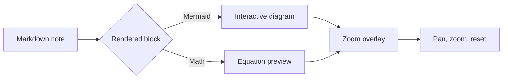

# Mermaid/Math Zoom Overlays

Complex diagrams and equations can feel cramped inline. Cribble opens them in a focused, glassmorphic zoom overlay so you can inspect the detail without losing your place.

**Try it on the diagram below:** hover over it and a small scale icon appears in the corner — click it, or just **double-click the diagram**, to open the overlay. Use the **+ / − / reset** controls (or trackpad pinch and scroll) to zoom and pan. Press **Esc**, click outside, or hit the **×** to close.

The same overlay works for standalone block equations — hover this one and click its scale icon:

$$
\operatorname{score}(q, d) =
\frac{q \cdot d}{\lVert q \rVert \lVert d \rVert}
$$

That cosine-similarity formula is exactly what powers [[Local Semantic Search]] under the hood.

Next: [[Reading Trails]]
