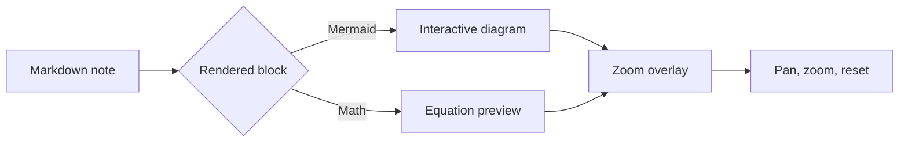

# Mermaid/Math Zoom Overlays

Cribble can open Mermaid diagrams and block equations in a focused zoom overlay. Hover a rendered diagram or equation, then use the scale control to inspect dense content.

The same overlay works for equations:

$$
\operatorname{score}(q, d) =
\frac{q \cdot d}{\lVert q \rVert \lVert d \rVert}
$$

This cosine similarity formula also gives semantic search something meaningful to index.

Next: [[Reading Trails]]
