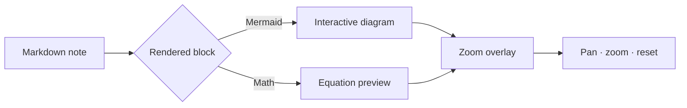

# Feature Tour

Four of Cribble's signature features — each one is interactive, so try them right here.

## 1. Zoom overlays (diagrams & math)

Complex diagrams and equations open in a focused overlay so you can inspect detail without losing your place.

> **Try it**
> **Double-click** the diagram below (or hover and click the ⤢ icon). Pinch/scroll to zoom, **Esc** to close.

The same overlay works for block equations — double-click this one:

$$
\operatorname{score}(q, d) = \frac{q \cdot d}{\lVert q \rVert\, \lVert d \rVert}
$$

That cosine-similarity formula is exactly what powers the semantic search below.

## 2. Reading Trails

Cribble remembers the route you take through notes and can turn it into a reusable artifact.

> **Try it**
> 1. Open [[Cribble AI]], then [[Markdown Showcase]], then come back here.
> 2. Press **P** to open the Reading Trail panel — watch your path build into a tree, with time spent on each note.
> 3. Click **Create Trail Note** — Cribble synthesizes your path, highlights, and notes into a new file (shown as a safe diff preview first).

## 3. Local semantic search

Beyond filename matching, Cribble runs an on-device semantic index, so search surfaces notes that *mean* the same thing — even when the words don't match.

> **Try it** — search these from the toolbar
> | Search phrase | What should surface |
> | --- | --- |
> | `keep my place while reading` | [[Getting Started]] (bookmarks) |
> | `private assistant on my mac` | [[Cribble AI]] |
> | `concept bridge between notes` | Pathfinder, below |
> | `zoom into a diagram` | The overlay section above |

## 4. Pathfinder — connect two notes

Pathfinder finds how two notes relate: the shortest wiki-link path **and** a conceptual bridge from the semantic index — then explains it.

> **Try it**
> Drag **[[Markdown Showcase]]** onto **[[Cribble AI]]** in the sidebar. Then choose **Explain the connection → an on-device model** for a one-paragraph synthesis (or use Claude / Codex). See [[Cribble AI]] for the AI details.

← Back to [[README|Home]]
