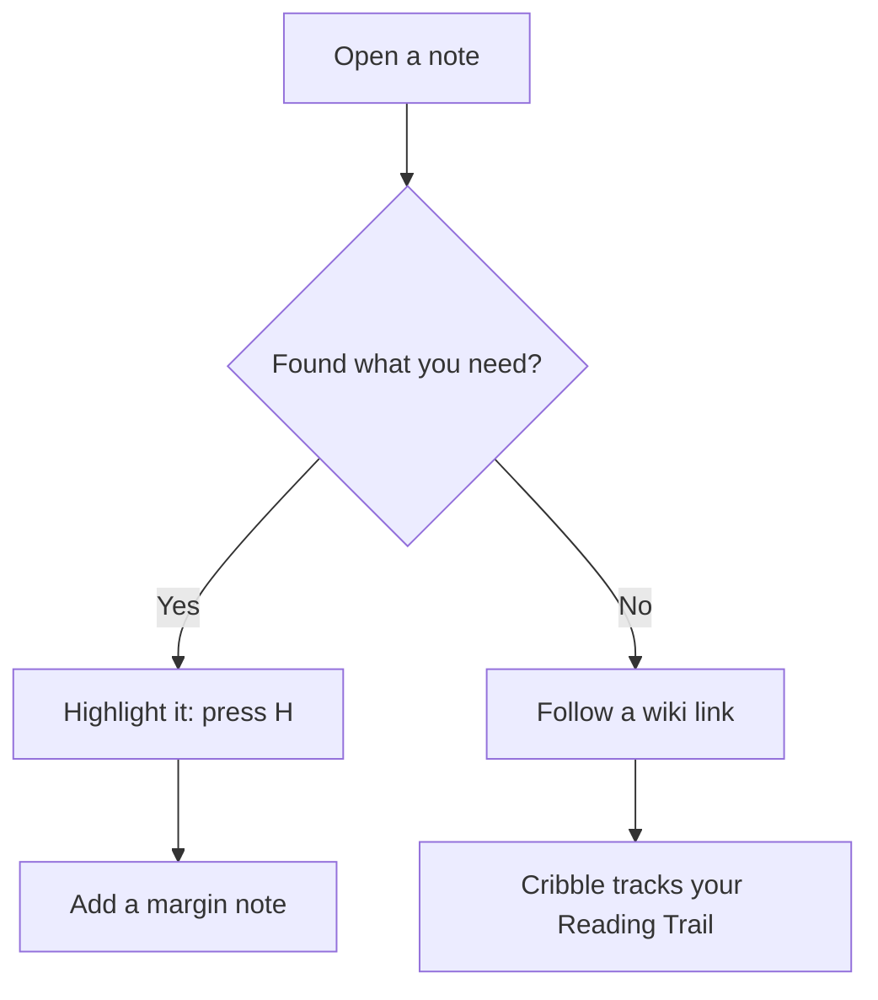

# Markdown Showcase

A reference for every rich Markdown element Cribble renders: inline & block math, GFM tables, nested blockquotes, task lists, footnotes, syntax-highlighted code, and Mermaid diagrams. It's also a great page to practice on — select any line and press **H** to highlight it.

---

## 1. Mathematical Formulas
Here is an inline math formula: $E = mc^2$, and here is a block math formula:

$$\int_0^1 x^2 dx = \frac{1}{3}$$

---

## 2. Mermaid Diagram

Double-click the diagram to open it in the zoom overlay.



---

## 3. GitHub Flavored Markdown (GFM) Table

Tables support column alignment, **bold**, `inline code`, and emoji.

| Feature | How to use it | Saved? |
| :--- | :--- | :---: |
| **Highlight** | Select text, press `H` | ✅ |
| **Margin note** | Right-click a highlight | ✅ |
| **Reading bookmark** | Press `B` | ✅ |
| **Wiki link** | Type `[[Note Name]]` | ✅ |

---

## 4. Blockquotes & Nesting
> This is a top-level blockquote.
>
>> This is a nested second-level blockquote that contains some **bold text** and `inline code`.

---

## 5. Footnotes & References
Here is a normal sentence with a footnote reference[^first_ref] to check the new footnote preprocessing engine.
And another one pointing to a second note[^second_ref].

[^first_ref]: This is the first footnote definition. It is extracted and dynamically appended to the glossary footer!
[^second_ref]: This is the second footnote definition, proving multi-footnote handling works seamlessly.

---

## 6. Task Lists
- [x] Open a Markdown folder
- [x] Highlight a sentence and add a note
- [ ] Build a Reading Trail and synthesize it into a note
- [ ] Drag one note onto another to find a path

---

## 7. Syntax-Highlighted Code Blocks

### Swift Code
```swift
struct Note: Identifiable {
    let id = UUID()
    var title: String
    var tags: [String]
}

let note = Note(title: "Welcome", tags: ["demo", "guide"])
print("Opened \(note.title)")
```

### JavaScript Code
```javascript
function greetUser(name) {
    console.log(`Hello, ${name}! Welcome to Cribble.`);
}
```

### Python Code
```python
def main():
    print("Verification complete.")
```
