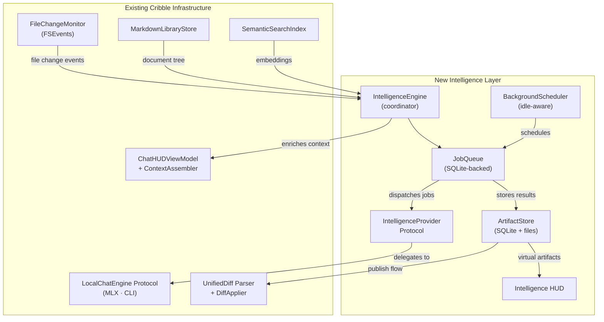
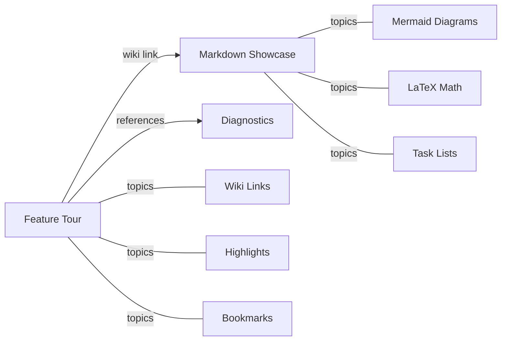

# Cribble Intelligence: Technical Design Document

| Field          | Value                                       |
|----------------|---------------------------------------------|
| Status         | Draft                                       |
| Version        | 0.2                                         |
| Last Updated   | 2026-06-02                                  |
| Authors        | —                                           |

---

## Implementation Status (2026-06-03)

Implemented on branch `feature/intelligence-phase1`. The engine layer is headless
and unit-tested (`Tests/CribbleTests/IntelligenceEngineTests.swift`,
`IntelligenceJobsTests.swift`); the UI mirrors the Chat HUD.

**Done (Phases 1–3):**
- SQLite DB + migrations + schema, **plus claim-level `artifact_provenance`** (research §5).
- `IntelligenceProvider` protocol; `LocalEngineIntelligenceProvider` (MLX/CLI + Apple NL
  embeddings) and a single `OpenAICompatibleProvider` covering Ollama/llama.cpp/LM Studio
  (research §3.1 — the plan's two HTTP providers collapsed into one).
- `WorkspaceScanner` + regex `SwiftSymbolExtractor`; FNV-1a `ContentHasher`.
- SQLite-backed job queue (hash-skip dedup, retry/backoff) + idle/thermal/battery
  `BackgroundScheduler`.
- Executors: summarize file, diff, commit; project index; fallback audit; dependency
  diagram + architecture narration; **architecture drift** (deterministic graph diff).
- `GitInspector`, `DependencyGraph` (static-analysis ground truth + Mermaid + drift),
  `OutputValidator` (path cross-ref + Mermaid sanity).
- `IntelligenceEngine` coordinator: idle scan→enqueue→drain loop, LRU disk budget,
  publish via `UnifiedDiff`/`DiffApplier`, scoped Q&A, Chat HUD context injection.
- Intelligence HUD (panel, artifact tree, reader, provenance footer, ask bar), sidebar
  status indicator, `⌘⇧I` command.

**Deferred (as the plan itself scopes them to "future"):** `sqlite-vec` migration (§15
Phase 3), SwiftSyntax/IndexStore parser (§11.2), clickable Mermaid → source navigation
and React Flow canvas (§13), the visual-sync "edit diagram → propose diff" flow (§12),
`ExtractIOBehavior` job, and the seeded DemoNotes example (§18).

---

## 1. Overview

Cribble Intelligence extends a project folder into a **living local knowledge base**. Instead of asking a small on-device model to "understand the repo" in a single pass, Cribble runs **many small, bounded, resumable intelligence jobs** that continuously produce reviewable project knowledge — Markdown summaries, architecture diagrams, diff explanations, behavior notes, and audit reports.

This fits Cribble's existing architecture: the app is already folder-native, Markdown-native, local-first, and built around safe reviewable changes. Intelligence adds a background enrichment layer on top of what already works.

### 1.1 Design Principles

1. **Small jobs, not monoliths.** The SLM receives one tiny task at a time. Deterministic code combines results.
2. **Preview before mutation.** Anything that touches the user's project folder is reviewable via the existing `UnifiedDiff` flow, unless the user enables auto-publish.
3. **Hash-based incremental work.** Every job records the content hash of its inputs. Unchanged files are skipped.
4. **Local-first, provider-agnostic.** No single runtime dependency. The provider layer abstracts MLX, Ollama, llama.cpp, and CLI engines behind a unified protocol.
5. **Idle-aware by default.** Heavy jobs run only when the machine is idle, on power, and thermally safe. Lightweight jobs may run in the foreground.

---

## 2. Glossary

These terms are used consistently throughout this document:

| Term                     | Definition |
|--------------------------|------------|
| **Intelligence Artifact** | A generated file (Markdown, Mermaid, D2) produced by the intelligence pipeline. The canonical output unit. |
| **Virtual Artifact**      | An artifact stored in Cribble's local cache, visible in the HUD but not written to the project folder. |
| **Published Artifact**    | An artifact written to `.cribble/intelligence/` in the project folder, committed alongside source code. |
| **Draft Artifact**        | An artifact awaiting user approval before being published. Presented via the existing diff-preview sheet. |
| **Intelligence HUD**      | A dedicated panel (separate from the Chat HUD) that renders the artifact tree, processing queue, and scoped project questions. |
| **Intelligence Job**      | A single unit of work in the background queue (e.g., summarize one file, parse one diff). |
| **Intelligence Engine**   | The top-level coordinator: scheduler + job queue + artifact store + provider layer. |

---

## 3. System Architecture



### 3.1 Integration Points with Existing Code

| New Component | Integrates With | How |
|---|---|---|
| `IntelligenceEngine` | `FileChangeMonitor` | Subscribes to FSEvents change stream to detect files needing re-processing. |
| `IntelligenceEngine` | `MarkdownLibraryStore` | Reads `nodes` / `documents` for the file tree. Uses `rootURLs` to scope projects. |
| `IntelligenceProvider` | `LocalChatEngine` | Wraps existing `MLXChatEngine` / `CLIChatEngine` for generation. Adds embedding + structured-output capabilities. |
| `ArtifactStore` (publish) | `UnifiedDiff` + `DiffApplier` | Publishing artifacts to `.cribble/intelligence/` goes through the standard diff-preview → apply flow. |
| Intelligence context | `ContextAssembler` | Artifact summaries injected as additional context blocks for Chat HUD responses. |
| `IntelligenceHUD` | `SemanticSearchIndex` | "Ask about this project" queries retrieve from both source embeddings and artifact embeddings. |

---

## 4. Intelligence Artifacts

### 4.1 Folder Structure

```text
project/
  .cribble/
    intelligence/                 ← Published artifacts (user-reviewable)
      project-index.md
      architecture/
        system-overview.mermaid
        dependency-map.mermaid
      changes/
        working-tree-diff.md
        commits/
          2026-06-02-a1b2c3.md
      behavior/
        api-behavior.md
        io-behavior.md
      audits/
        fallback-audit.md
        error-boundaries.md
    cache/
      intelligence.db             ← Single SQLite database (jobs + artifacts + metadata)
```

> **Note:** `.cribble/` SHOULD be added to `.gitignore` by default when Intelligence is first enabled. The user may opt to track `.cribble/intelligence/` (published artifacts) while ignoring `.cribble/cache/`. Cribble prompts the user about this on first enable if a `.gitignore` exists.

### 4.2 Artifact Types

| Category | Examples | Format | Phase |
|----------|----------|--------|-------|
| **Project Index** | `project-index.md` | Markdown | 1 |
| **File Summaries** | `summaries/<file-hash>.md` | Markdown | 1 |
| **Diff Intelligence** | `working-tree-diff.md`, `commits/<hash>.md` | Markdown | 2 |
| **Architecture Diagrams** | `system-overview.mermaid`, `dependency-map.mermaid` | Mermaid | 2 |
| **Behavior Maps** | `api-behavior.md`, `io-behavior.md` | Markdown | 3 |
| **Audits** | `fallback-audit.md`, `error-boundaries.md`, `silent-failures.md` | Markdown | 3 |
| **Architecture Drift** | `drift-report.md` | Markdown | 3 |

### 4.3 Lifecycle

```text
Job completes
  → Artifact written to cache (Virtual)
  → HUD updates immediately
  → User clicks "Publish" (or auto-publish is on)
  → Cribble generates a UnifiedDiff for the target path
  → DiffPreviewSheet shown
  → User approves → DiffApplier writes to .cribble/intelligence/
```

---

## 5. Storage

### 5.1 Design Decision: Single SQLite Database

All intelligence state lives in **one** SQLite database at `.cribble/cache/intelligence.db`. This simplifies migrations, transactions, and backup. No `sqlite-vec` dependency in Phase 1 — vector search continues using the existing `SemanticSearchIndex` (Apple NL embeddings + JSON persistence). A `sqlite-vec` migration is deferred until Phase 3 and gated behind a protocol.

### 5.2 Schema

```sql
-- Database version tracking for migrations
CREATE TABLE schema_version (
    version     INTEGER PRIMARY KEY,
    applied_at  TEXT NOT NULL DEFAULT (datetime('now'))
);

-- Tracked source files
CREATE TABLE files (
    id          INTEGER PRIMARY KEY AUTOINCREMENT,
    project_id  TEXT NOT NULL,                      -- rootURL identifier
    path        TEXT NOT NULL,                      -- relative to project root
    hash        TEXT NOT NULL,                      -- FNV-1a content hash
    size_bytes  INTEGER NOT NULL,
    language    TEXT,                               -- detected language (swift, markdown, etc.)
    updated_at  TEXT NOT NULL DEFAULT (datetime('now')),
    UNIQUE(project_id, path)
);
CREATE INDEX idx_files_hash ON files(hash);

-- Parsed code symbols (functions, types, protocols)
CREATE TABLE symbols (
    id          INTEGER PRIMARY KEY AUTOINCREMENT,
    file_id     INTEGER NOT NULL REFERENCES files(id) ON DELETE CASCADE,
    name        TEXT NOT NULL,
    kind        TEXT NOT NULL,                      -- 'function', 'type', 'protocol', 'extension', 'property'
    start_line  INTEGER,
    end_line    INTEGER,
    signature   TEXT,                               -- full declaration signature
    hash        TEXT NOT NULL                       -- hash of the symbol's source text
);
CREATE INDEX idx_symbols_file ON symbols(file_id);

-- Intelligence jobs
CREATE TABLE jobs (
    id                  TEXT PRIMARY KEY,            -- UUID
    project_id          TEXT NOT NULL,
    job_type            TEXT NOT NULL,               -- enum value: 'summarize_file', 'summarize_diff', etc.
    input_hash          TEXT NOT NULL,               -- hash of all inputs; skip if unchanged
    input_paths         TEXT,                        -- JSON array of relative paths
    status              TEXT NOT NULL DEFAULT 'pending',  -- 'pending', 'running', 'completed', 'failed', 'cancelled'
    priority            INTEGER NOT NULL DEFAULT 100,     -- lower = higher priority
    model_id            TEXT,                        -- which model was used
    attempt_count       INTEGER NOT NULL DEFAULT 0,
    max_attempts        INTEGER NOT NULL DEFAULT 3,
    error_message       TEXT,
    output_artifact_id  TEXT REFERENCES artifacts(id),
    created_at          TEXT NOT NULL DEFAULT (datetime('now')),
    started_at          TEXT,
    finished_at         TEXT
);
CREATE INDEX idx_jobs_status ON jobs(status, priority);
CREATE INDEX idx_jobs_input_hash ON jobs(input_hash);

-- Generated artifacts
CREATE TABLE artifacts (
    id              TEXT PRIMARY KEY,                -- UUID
    project_id      TEXT NOT NULL,
    artifact_type   TEXT NOT NULL,                   -- 'file_summary', 'diff_summary', 'architecture_diagram', etc.
    relative_path   TEXT NOT NULL,                   -- path within .cribble/intelligence/
    title           TEXT,
    content_hash    TEXT NOT NULL,                   -- hash of the artifact content
    source_hashes   TEXT NOT NULL,                   -- JSON array of input file hashes that produced this
    is_published    INTEGER NOT NULL DEFAULT 0,
    created_at      TEXT NOT NULL DEFAULT (datetime('now')),
    updated_at      TEXT NOT NULL DEFAULT (datetime('now'))
);
CREATE INDEX idx_artifacts_type ON artifacts(artifact_type);
CREATE INDEX idx_artifacts_project ON artifacts(project_id);

-- Git state tracking
CREATE TABLE git_commits (
    id          INTEGER PRIMARY KEY AUTOINCREMENT,
    project_id  TEXT NOT NULL,
    sha         TEXT NOT NULL,
    message     TEXT,
    author      TEXT,
    timestamp   TEXT NOT NULL,
    is_summarized INTEGER NOT NULL DEFAULT 0,
    UNIQUE(project_id, sha)
);
```

### 5.3 Migration Strategy

The `schema_version` table tracks applied migrations. On launch, `IntelligenceDatabase` checks the current version and applies any pending migrations sequentially. Migrations are Swift functions keyed by version number. If a migration fails, the database is backed up and recreated from scratch (intelligence data is always regenerable).

---

## 6. Provider Layer

### 6.1 Design Decision: Extend, Don't Replace

The existing `LocalChatEngine` protocol handles interactive chat well. Intelligence jobs need different capabilities: **structured output**, **embedding generation**, and **batch scheduling**. Rather than modifying `LocalChatEngine`, a new `IntelligenceProvider` protocol wraps it and adds what's needed.

### 6.2 Protocol Sketch

```swift
/// A provider capable of running intelligence jobs (generation + embeddings).
protocol IntelligenceProvider: Sendable {
    /// Human-readable provider name for HUD display.
    var displayName: String { get }

    /// Whether this provider is currently available (model downloaded, server running, etc.)
    func checkAvailability() async -> ProviderAvailability

    /// Generate a completion from a structured prompt.
    /// - Parameter prompt: The assembled prompt with system + user messages.
    /// - Parameter schema: Optional JSON schema for structured output (if supported).
    /// - Returns: The generated text.
    func generate(
        prompt: [EngineMessage],
        schema: JSONSchema?,
        maxTokens: Int
    ) async throws -> String

    /// Generate an embedding vector for the given text.
    /// Returns nil if the provider does not support embeddings.
    func embed(text: String) async throws -> [Float]?
}

enum ProviderAvailability {
    case available
    case unavailable(reason: String)    // "Ollama not running", "Model not downloaded"
    case degraded(reason: String)       // "Running on CPU — slow"
}
```

### 6.3 Concrete Providers

| Provider | Wraps | Embeddings | Structured Output | Phase |
|----------|-------|------------|-------------------|-------|
| `MLXIntelligenceProvider` | Existing `MLXChatEngine` | Via Apple `NLContextualEmbedding` (existing) | Prompt-based (no schema enforcement) | 1 |
| `CLIIntelligenceProvider` | Existing `CLIChatEngine` | Via Apple NL (existing) | Prompt-based | 1 |
| `OllamaIntelligenceProvider` | New: OpenAI-compatible HTTP | Via `/v1/embeddings` endpoint | Via `response_format: { type: "json_schema" }` | 2 |
| `LlamaCppIntelligenceProvider` | New: OpenAI-compatible HTTP | Via `/v1/embeddings` endpoint | Via `response_format` | 2 |

Phase 1 reuses the existing engines for generation and the existing `EmbeddingEngine` for embeddings. No new runtime dependencies.

---

## 7. Job System

### 7.1 Job Types

Jobs are grouped by complexity tier. Each tier maps to an idle-awareness policy:

**Tier 1 — Always allowed** (lightweight, no SLM):
| Job | Input | Output |
|-----|-------|--------|
| `ScanWorkspace` | `rootURL` | Updated `files` table |
| `DetectChangedFiles` | `files` table vs filesystem hashes | List of changed file IDs |
| `ParseCodeSymbols` | Source file | Updated `symbols` table |
| `ExtractImports` | Source file | Dependency edges in `symbols` |

**Tier 2 — Foreground allowed** (small SLM calls):
| Job | Input | Output |
|-----|-------|--------|
| `SummarizeFile` | One source file (≤12K chars) | `file_summary` artifact |
| `SummarizeDiff` | Git diff text | `diff_summary` artifact |
| `SummarizeCommit` | Commit message + diff | `commit_summary` artifact |
| `ExtractFallbackLogic` | One source file | `fallback_audit` artifact |

**Tier 3 — Idle only** (multi-file SLM calls):
| Job | Input | Output |
|-----|-------|--------|
| `BuildDependencyDiagram` | Import edges from `symbols` | `dependency_map.mermaid` artifact |
| `BuildArchitectureDiagram` | File + symbol summaries | `system_overview.mermaid` artifact |
| `UpdateProjectIndex` | All file summaries | `project_index.md` artifact |
| `DetectArchitectureDrift` | Diagram edges vs code edges | `drift_report.md` artifact |

### 7.2 Job Lifecycle

```text
pending → running → completed
                  → failed (retry if attempt_count < max_attempts)
                  → cancelled (user-initiated or app termination)
```

**Retry policy:** Exponential backoff — 5s, 30s, 120s. After `max_attempts` (default 3), job moves to `failed` with `error_message` preserved. User can manually retry failed jobs from the HUD.

**Cancellation:** On app quit, all `running` jobs revert to `pending`. On project close, jobs for that `project_id` are cancelled.

### 7.3 Cache Invalidation

When a file changes (detected via `FileChangeMonitor`):

1. The `files` row is updated with the new hash.
2. All `artifacts` whose `source_hashes` JSON array contains the old hash are marked stale.
3. New jobs are enqueued for the changed file: `ParseCodeSymbols` → `SummarizeFile`.
4. Downstream aggregate jobs (`UpdateProjectIndex`, `BuildArchitectureDiagram`) are re-enqueued only after their upstream dependencies complete and if the upstream outputs actually changed.

This is a **bottom-up invalidation**: file change → file-level jobs → aggregation jobs. No full reindex on every save.

### 7.4 Output Validation

SLMs produce unreliable output. Every artifact goes through validation before storage:

| Artifact Type | Validation |
|---|---|
| Markdown summaries | Non-empty, ≤ expected length, no hallucinated file paths (cross-check against `files` table) |
| Mermaid diagrams | Syntax check via the existing `MermaidHTML` renderer (render in headless WKWebView, check for JS errors) |
| Diff summaries | Referenced file paths exist in the project |

If validation fails, the job is retried with an appended "your previous output had these errors" correction prompt. After `max_attempts`, the artifact is stored with an `unvalidated` flag visible in the HUD.

---

## 8. Idle-Aware Scheduling

### 8.1 Scheduling Policy

| Condition | Tier 1 | Tier 2 | Tier 3 |
|-----------|--------|--------|--------|
| App foreground, user active | ✅ | ✅ | ❌ |
| App foreground, user idle (>60s no keystrokes) | ✅ | ✅ | ✅ |
| App background | ✅ | ❌ | ❌ |
| On battery | ✅ | ❌ | ❌ |
| Thermal state ≥ serious | ❌ | ❌ | ❌ |

### 8.2 Implementation

```swift
actor BackgroundScheduler {
    /// Monitors idle state via CGEventSource.secondsSinceLastEventType
    /// Polls every 10s on a low-priority timer — not CGEventTap (no permissions needed).
    private var userIdleSeconds: TimeInterval { ... }

    /// Checks ProcessInfo.thermalState
    private var thermalState: ProcessInfo.ThermalState { ... }

    /// Checks ProcessInfo.isLowPowerModeEnabled (battery)
    private var isOnBattery: Bool { ... }

    /// Returns the maximum job tier allowed right now.
    func allowedTier() -> JobTier {
        if thermalState >= .serious { return .none }
        if isOnBattery { return .tier1 }
        if userIdleSeconds > 60 { return .tier3 }
        if NSApp.isActive { return .tier2 }
        return .tier1
    }
}
```

### 8.3 Hard Caps

- Max concurrent SLM jobs: **1** (serialized via the `IntelligenceProvider`)
- Max memory budget for intelligence DB: **200 MB** (configurable)
- Pause on battery: **default on** (user toggle)
- Pause on thermal state ≥ serious: **always**
- Disk budget for `.cribble/cache/`: **500 MB** default, configurable. Oldest artifacts evicted LRU when exceeded.

---

## 9. Sidebar UX

A small status indicator appears next to each opened folder name in the sidebar:

```text
MyProject      ◇   Intelligence off
MyProject      ◌   Ready to scan
MyProject      ◐   Indexing (3/47 files)
MyProject      ●   12 new artifacts
MyProject      !   Drift detected
```

**Click:** Opens the Intelligence HUD.

**Right-click menu:**
- Run now
- Pause intelligence
- Only run when idle
- Publish all artifacts…
- Rebuild index
- Clear cache
- Show `.cribble/intelligence/` in Finder

### 9.1 First-Run Flow

1. User clicks the Intelligence indicator for the first time.
2. Cribble shows: *"Build local project intelligence for this folder?"* with model selection.
3. If no local model is downloaded, Cribble offers to download one (reusing the existing model download flow from `ModelLoadProgress`). If only CLI providers are available, Cribble warns: *"Intelligence works best with a local model. CLI providers (Claude/Codex) will be used but may be slower and have rate limits."*
4. On confirm, Cribble checks for `.gitignore` and offers to add `.cribble/cache/` to it.
5. Background scanning begins.

---

## 10. Intelligence HUD

The Intelligence HUD is a **separate panel** from the Chat HUD. It is a project intelligence cockpit, not a conversation.

```text
┌──────────────────────────────────────────────┐
│ Intelligence · MyProject                     │
│ Qwen 3.5 4B · Idle mode · 47/47 files       │
├──────────────────────────────────────────────┤
│ Left Panel          │ Center Panel           │
│                     │                        │
│ ▸ Architecture      │ Rendered artifact:     │
│   system-overview   │ Markdown / Mermaid /   │
│   dependency-map    │ diff view              │
│ ▸ Changes           │                        │
│   working-tree-diff │                        │
│   commit-a1b2c3     │                        │
│ ▸ Audits            │                        │
│   fallback-audit    │                        │
│                     │                        │
│ ▸ Queue (2 pending) │                        │
│   ◐ SummarizeFile   │                        │
│   ◌ UpdateIndex     │                        │
├──────────────────────────────────────────────┤
│ Ask about this project…                      │
└──────────────────────────────────────────────┘
```

**Left panel:** Live artifact tree + job queue with status indicators.
**Center panel:** Renders the selected artifact using existing infrastructure — `StructuredText` for Markdown, `MermaidWebDiagramView` for Mermaid, `DiffPreviewSheet`-style rendering for diffs.
**Bottom bar:** Scoped question input. Retrieves from artifact content + source embeddings via `SemanticSearchIndex`. Routes through `ContextAssembler` with artifact context injected.

**Artifact actions** (right-click on any artifact):
- Open in reader (navigates to the Markdown in the main content area)
- Publish to project… (diff preview → apply)
- Regenerate
- Delete

---

## 11. SLM Execution Model

### 11.1 Pipeline

```text
FileChangeMonitor detects changes
  ↓
IntelligenceEngine updates `files` table with new hashes
  ↓
Deterministic parser extracts symbols/functions/classes
  ↓
SLM summarizes each changed file independently (≤12K chars input)
  ↓
Cribble stores summaries keyed by content hash
  ↓
SLM generates aggregate artifacts (diagrams, index) from summaries
  ↓
Cribble validates output (syntax, file path references, length)
  ↓
HUD updates with new/refreshed artifacts
```

### 11.2 Code Parser

Phase 1 uses **regex-based extraction** for Swift files:
- Function boundaries via `func` keyword + brace matching
- Type declarations via `class`, `struct`, `enum`, `protocol`, `actor`
- Import statements
- Extension declarations

Phase 2 evaluates **SwiftSyntax** (Apple's official parser, available as a SwiftPM package) for precise AST-level extraction. SwiftSyntax is heavyweight (~50 MB binary impact) so it is deferred.

> **Note:** Regex-based parsing is imprecise but sufficient for summarization prompts. The SLM does not need a perfect AST — it needs enough context to produce useful summaries.

### 11.3 Prompt Design

Every SLM prompt follows a template:

```text
SYSTEM: You are a code analysis assistant. Output ONLY the requested format.
        Do not include explanations outside the format.

USER:   [task-specific instruction]
        [bounded input: one file, one diff, or a set of summaries]

FORMAT: [explicit output format: markdown template, mermaid syntax, etc.]
```

Structured output (Mermaid, JSON) includes a format example in the prompt. If the provider supports schema-constrained generation (Ollama, llama.cpp), the schema is passed via `response_format`.

---

## 12. Visual Sync Model (Future — Phase 3+)

> **This section describes a future capability, not part of the initial build.**

The safe version of "visual update changes code":

```text
User edits architecture diagram (text source)
  → Cribble updates the diagram spec
  → Cribble compares spec edges to code graph edges
  → Cribble reports: implemented / missing / conflicting
  → User asks "make code match"
  → SLM proposes a UnifiedDiff
  → DiffPreviewSheet shown
  → User approves → DiffApplier writes changes
```

This reuses the existing diff preview → apply flow. No silent mutations.

---

## 13. Canvas Rendering Roadmap (Future)

| Phase | Rendering | Interaction |
|-------|-----------|-------------|
| Phase 1 | Mermaid via existing `MermaidWebDiagramView` | View-only with existing zoom overlay |
| Phase 2 | Mermaid with clickable nodes → source file navigation | Click node → open file in reader |
| Phase 3 | React Flow in WKWebView for interactive graph editing | Drag, connect, annotate |

D2 diagram support is deferred. D2 requires an external Go binary, which conflicts with App Store sandboxing. If needed for DMG builds, it can be added as an optional CLI dependency with graceful degradation to Mermaid.

---

## 14. Accessibility

The Intelligence HUD MUST support:
- Full keyboard navigation (tab between panels, arrow keys within artifact tree)
- VoiceOver labels on all status indicators, artifact items, and job queue entries
- Dynamic Type in all rendered Markdown content
- Sufficient color contrast for status icons (not color-only; icons use distinct shapes: ◇ ◌ ◐ ● !)

---

## 15. Phasing

### Phase 1: Foundation (Target: 4–6 weeks)

**Goal:** File summaries and project index, using existing engines, stored as Markdown.

| Component | Work |
|---|---|
| `IntelligenceDatabase` | SQLite wrapper with schema from §5.2. Migration runner. |
| `IntelligenceProvider` protocol | Protocol definition. `MLXIntelligenceProvider` and `CLIIntelligenceProvider` wrapping existing engines. Embeddings via existing `EmbeddingEngine`. |
| `WorkspaceScanner` | Reads `MarkdownLibraryStore.nodes`, hashes files, populates `files` table. Regex-based Swift symbol extraction into `symbols` table. |
| `JobQueue` | SQLite-backed queue. Tier 1 + Tier 2 jobs only. Serial execution. |
| `BackgroundScheduler` | Idle detection via `CGEventSource`. Thermal + battery checks. |
| Job: `SummarizeFile` | Summarize one file using `IntelligenceProvider.generate()`. Store as artifact. |
| Job: `UpdateProjectIndex` | Combine file summaries into `project-index.md`. |
| Sidebar indicator | Status icon next to folder name. Click opens a simple artifact list (not full HUD yet). |
| Chat HUD integration | Inject file summaries into `ContextAssembler` as additional context. |
| First-run flow | Model selection prompt, `.gitignore` suggestion. |
| Seeded example | Pre-generated artifacts for the bundled `DemoNotes` workspace. |

**Not in Phase 1:** Git integration, Mermaid generation, full HUD, Ollama/llama.cpp providers, audits, drift detection, publishing flow.

---

### Phase 2: Git Intelligence + HUD (Target: 4–6 weeks after Phase 1)

| Component | Work |
|---|---|
| `GitInspector` | Shell out to `git log`, `git diff`, `git status`. Populate `git_commits` table. |
| Jobs: `SummarizeDiff`, `SummarizeCommit` | Diff and commit intelligence artifacts. |
| Jobs: `BuildDependencyDiagram`, `BuildArchitectureDiagram` | Mermaid output. Validated via headless render. |
| `OllamaIntelligenceProvider` | OpenAI-compatible HTTP client. Structured output via `response_format`. |
| Full Intelligence HUD | Three-panel layout (artifact tree, rendered content, question bar). Floating NSPanel like Chat HUD. |
| Publish flow | "Publish to project" action → `UnifiedDiff` → `DiffPreviewSheet` → `DiffApplier`. |
| Disk budget enforcement | LRU eviction of oldest cached artifacts when `.cribble/cache/` exceeds budget. |

---

### Phase 3: Audits + Advanced (Target: open-ended)

| Component | Work |
|---|---|
| Jobs: `ExtractFallbackLogic`, `ExtractIOBehavior`, `DetectArchitectureDrift` | Audit and drift artifacts. |
| `LlamaCppIntelligenceProvider` | Second OpenAI-compatible provider. |
| `sqlite-vec` migration | Behind protocol. Optional upgrade from Apple NL embeddings to model-generated vectors stored in SQLite. |
| Clickable Mermaid nodes | Node click → navigate to source file in reader. |
| SwiftSyntax parser | Replace regex extraction with full AST parsing (evaluate binary size impact). |

---

## 16. Verification Plan

### Automated Tests

- **Unit tests** for `IntelligenceDatabase`: schema creation, migrations, CRUD operations, cache invalidation logic.
- **Unit tests** for `JobQueue`: enqueue, dequeue, retry, cancellation, hash-skip.
- **Unit tests** for `WorkspaceScanner`: regex symbol extraction against known Swift files.
- **Unit tests** for output validation: Mermaid syntax checking, file path cross-referencing.
- **Integration test**: End-to-end `SummarizeFile` job with a mock `IntelligenceProvider` returning canned output.

### Manual Verification

- Build and run the app. Enable Intelligence on a real project folder.
- Verify sidebar indicator updates as scanning progresses.
- Verify file summaries appear in the artifact list.
- Verify Chat HUD responses improve with artifact context injected.
- Verify idle-awareness: jobs pause when typing, resume when idle.
- Verify thermal/battery throttling on a MacBook.

---

## 17. Risks and Mitigations

| Risk | Severity | Mitigation |
|------|----------|------------|
| SLM produces invalid Mermaid syntax | High | Validate via headless render. Retry with error feedback. Fallback to raw text display. |
| SLM hallucinates file paths or symbol names | High | Cross-reference all paths against `files` table. Flag unvalidated artifacts in HUD. |
| Intelligence DB grows too large | Medium | Disk budget with LRU eviction. User-visible storage indicator in HUD. |
| Model not available on first run | Medium | Graceful degradation: scan + parse (Tier 1) work without a model. Summarization waits. |
| `CGEventSource` idle detection inaccurate | Low | 10s polling granularity is sufficient. False positives (running jobs while user is active) are low-impact since max 1 concurrent SLM job. |
| Schema migrations break on upgrade | Low | Backup DB before migration. Intelligence data is regenerable — worst case is a full reindex. |

---

## 18. Seeded Workspace Example

When Intelligence is first enabled on the bundled **DemoNotes** workspace, Cribble pre-populates artifacts to demonstrate the feature immediately:

### `project-index.md`

```markdown
# DemoNotes — Project Index

This workspace contains Markdown demonstrations showcasing Cribble's core features.

## Files

| File | Purpose | Key Topics |
|------|---------|------------|
| Feature Tour.md | Interactive walkthrough | Wiki links, highlights, bookmarks |
| Markdown Showcase.md | Rendering reference | LaTeX equations, Mermaid diagrams, task lists |
| Diagnostics.md | Troubleshooting guide | Diagnostic reports, system checks |

## Connections

- **Feature Tour** references concepts demonstrated in **Markdown Showcase** (e.g., wiki link syntax).
- **Diagnostics** is standalone — no inbound or outbound wiki links.

## Statistics

- 3 documents, ~2,400 words total
- 5 wiki links across documents
- 2 Mermaid diagrams, 1 LaTeX block
```

### `architecture/content-map.mermaid`



### `audits/content-quality.md`

```markdown
# Content Quality Audit — DemoNotes

## Observations

- **Diagnostics.md** has no inbound wiki links from other notes. Consider adding
  a `[[Diagnostics]]` reference in Feature Tour under a "Troubleshooting" section.
- **Markdown Showcase.md** contains a Mermaid `pie` chart but no `sequenceDiagram`.
  The app supports both — consider adding a sequence diagram example.
- **Feature Tour.md** mentions "bookmarks" but does not include a visible bookmark
  demonstration. A seeded bookmark annotation would make the feature self-documenting.

## Coverage

| Feature | Demonstrated | Notes |
|---------|-------------|-------|
| Wiki links | ✅ | 5 links across 2 files |
| Highlights | ✅ | Feature Tour includes examples |
| Bookmarks | ⚠️ | Mentioned but not demonstrated |
| Mermaid | ✅ | Pie chart in Showcase |
| LaTeX | ✅ | Equations in Showcase |
| Task lists | ✅ | Nested tasks in Showcase |
```

> **Note:** These seeded artifacts are bundled in the app resources and copied to `.cribble/cache/` on first DemoNotes open. They are not generated by the SLM — they demonstrate the artifact format and HUD layout before the user's first real intelligence run.
